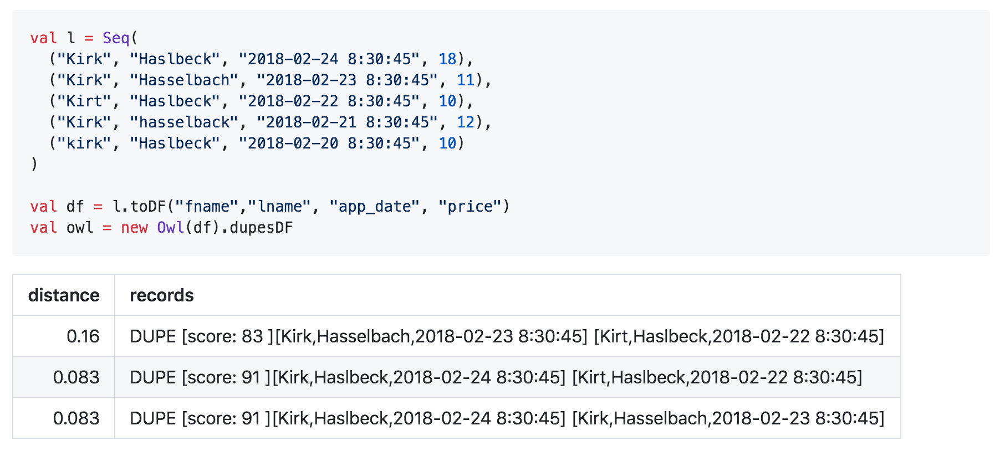

# Duplicates

## General Ledger.  Accounting use-case



Whether you're looking for a fuzzy matching percent or single client cleanup, Owl's duplicate detection can help you sort and rank the likelihood of duplicate data.


```text
-f file:///home/ec2-user/single_customer.csv \
-d "," \
-ds customers \
-rd 2018-01-08 \
-dupe \
-dupenocase \
-depth 4
```

## User Table has duplicate user entry

Carrisa Rimmer vs Carrissa Rimer


## ATM customer data with only a 88% match

As you can see below, less than a 90% match in most cases is a false positive. Each dataset is a bit different, but in many cases you should tune your duplicates to roughly a 90+% match for interesting findings.


## Simple DataFrame Example



