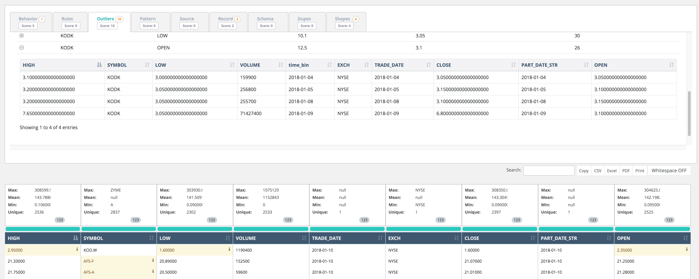

# Outliers

### Numerical Outliers

Kodak Coin!  in 2018 Kodak announced themselves as Kodak coin and witnessed a steep change in their stock price.  Owl automatically captured this event and provided the ability to drill into the item.



### Categorical Outliers

A 3 minute read on the topic.



Owl will automatically learn the normal behavior of your Strings and Categorical attributes such as STOCK,OPTION,FUTURE  or state codes such as . MD,NC,D.C.    when a strange pattern occurs such as NYC instead of NY Owl will show this as a categorical outlier.

### Spark DataFrame Example


### Real World Example

Imagine you are the data manager at Iowa Department of Commerce, Alcoholic Beverage Division. As part of the Department's open data initiative, the monthly[ Iowa liquor sales data](https://data.iowa.gov/Sales-Distribution/Iowa-Liquor-Sales/m3tr-qhgy) are available to the public for analysis. \(Thank you Iowa!\)

An Iowan data analyst emails you about a data quality issue with **address** for store \#2508 in the year 2016. You quickly run a SQL query on your data warehouse to see what is going on.   
****

```sql
-- Assuming Postgres DB
select date_trunc('MONTH', "date") "date_month", address, count(*) "sales_count"
from iowa_liquor_sales 
where "date" >= '2016-01-01' and "date" < '2017-01-01' and store_number = '2508'
group by date_trunc('MONTH', "date"), address
order by date_month, address
```

| date\_month | address | sales\_count |
| :--- | :--- | :--- |
|  2016-01-01 00:00:00 | 1843 JOHNSON AVENUE, N.W. |  422 |
|  2016-02-01 00:00:00 | 1843 JOHNSON AVENUE, N.W. |  451 |
|  2016-03-01 00:00:00 | 1843 JOHNSON AVENUE, N.W. |  579 |
|  2016-04-01 00:00:00 | 1843 JOHNSON AVENUE, N.W. |  404 |
|  2016-05-01 00:00:00 | 1843 Johnson Avenue, N.W. |  625 |
|  2016-06-01 00:00:00 | 1843 Johnson Avenue, N.W. |  695 |
|  2016-07-01 00:00:00 | 1843 Johnson Avenue, N.W. |  457 |
|  2016-08-01 00:00:00 | 1843 Johnson Avenue, N.W. |  744 |
|  2016-09-01 00:00:00 | 1843 Johnson Avenue, N.W. |  681 |
|  2016-10-01 00:00:00 | 1843 Johnson Avenue, N.W. |  728 |
|  2016-11-01 00:00:00 | 1843 Johnson Avenue, N.W. |  1062 |
|  2016-12-01 00:00:00 | 1843 Johnson Avenue, N.W. |  992 |

Because `store_number` is an unique number assigned to the store who ordered the liquor, the inconsistent `address` values for the same store pose data quality problem. But `address` is a string value that can take many forms. For store \#2508, the reported address value has a shifted behavior from all capital letters starting on May 2016. For other cases, it might be completely different behavior change that you would have to manually check one by one. With over 2,000 unique stores, 19 million rows, and 8 years of data, you need an automated way to detect meaningful categorical outliers.

The following command shows an example of running monthly OwlDQ Checks, from the month of Jan 2016 to the month of December 2016. Each monthly run looks back 3 months of data to establish a baseline for categorical columns that you suspect would have similar data quality issues: `store_name`, `address`, and`city`.

```bash
/opt/owl/bin/owlcheck 
  # connection information to data
  -lib "/opt/owl/drivers/postgres/" -driver "org.postgresql.Driver"
  -c, "jdbc:postgresql://localhost:5432/postgres"
  -u, "postgres", "-p", "password"
  # Specify dataset name
  -ds "iowa_liquor_sales_by_store_number_monthly"
  # Specify date filter for the last filter, e.g. date >= '2016-12-01' and date < '2017-01-01'
  -rd "2016-12-01" -rdEnd "2017-01-01" 
  # SQL query template (${rd} and ${rdEnd} matches with -rd and -rdEnd
  -q "select distinct on (date, store_number) date, store_number, store_name, address, city
       from iowa_liquor_sales where date >= '${rd}' and date < '${rdEnd}' "
  # Turn on Outliers
  -dl
  # Group on store_number (optional if no grouping)
  -dlkey "store_number"
  # Specify column that is of date type (optional, if running OwlCheck without time context)
  -dc "date"
  # Specify columns to run Outlier analysis (if not specified, all the columns in query are included in analysis)
  -dlinc "store_name,address,city"
  # Specify 3 month lookback for each OwlCheck
  -dllb 3 
  # Run Monthly OwlCheck
  -tbin "MONTH"
  # "backrun" Convenient way to run 12 preceding MONTHly owl check
  -br 12
```

#### Results

The `-br 12` option ran 12 monthly OwlChecks for every month of 2016. The figure below shows OwlCheck Hoot page for the lastest run of dataset `iowa_liquor_sales_by_store_numbers_monthly`. The Hoot page shows that OwlCheck identified 24 Outliers among 4.8k rows of unique date x store\_number for month of December, 2016.


Since the original data quality issue that inspired us to run OwlCheck is from May 2016, we can navigate to specific run date 2016-05-01 by click on the line graph on top. Then searching for store \#2508 on the **key** column shows outlier detected for **column** `address`. Press \[+\] for that row to see contextual details about this detected value.


We can verify that OwlCheck identified the outlier of interest among other 60 data quality issues. Using OwlCheck, you can identify issues at scale for past data \(using backrun\), current \(using simple OwlCheck\), and future \(using scheduled jobs\).


