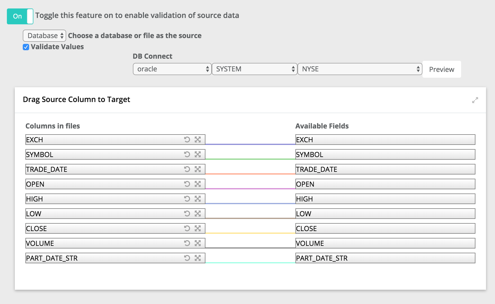

# Validate Source

## Does your data-lake reconcile with your upstream system?

Copying data from one system to another is probably the most common data activity to all organizations. Owl refers to this as source to target. As simple as this activity sounds, Owl has found that most of the time files and database tables are not being copied properly. To ensure and protect against target systems getting out of sync or not matching the originating source, turn on `-vs` to validate that the source matches the target.

## A row count is not enough...

The most common check we encounter is a row count. However, a row count does not account for:

* Schema differences - Boolean to Int,  Decimal to Double with precision loss, Timestamps and Dates
* Value differences - Char or Varchars with whitespace vs Strings, null chars, delimiter fields that cause shifting, and much more.



## OwlCheck Created from Wizard

The Owl Wizard GUI creates the below OwlCheck which it can execute from the GUI by clicking RUN or by pasting at the cmdline.

```bash
-lib /home/ec2-user/owl/drivers/valdrivers \
-driver org.postgresql.Driver \
-u user -p password \
-c "jdbc:postgresql://ec2-34-227-151-67.compute-1.amazonaws.com:5432/postgres" \
-q "select * from public.dateseries4" \
-ds psql_dateseries2 -rd 2018-11-07 \
-srcq select dz, sym as symz, high as highz, low as lowz, close as closez, volume as volumez, changed as changedz, changep as changepz, adjclose as adjclosez, open as openz from lake.dateseries \
-srcu user \
-srcp password \
-srcds mysqlSYMZ \
-srcd com.mysql.cj.jdbc.Driver \
-srcc "jdbc:mysql://owldatalake.chzid9w0hpyi.us-east-1.rds.amazonaws.com:3306/lake" \ -valsrckey "SYMZ" \
-vs \
-valsrcinc "dz,symz,openz,highz,lowz,closez,volumez,changedz,changepz,adjclosez"
```

