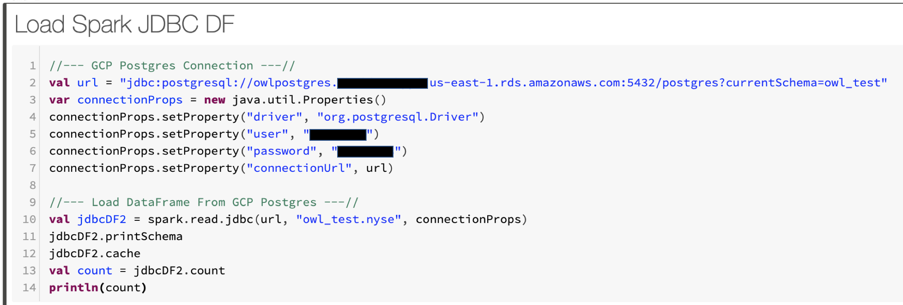
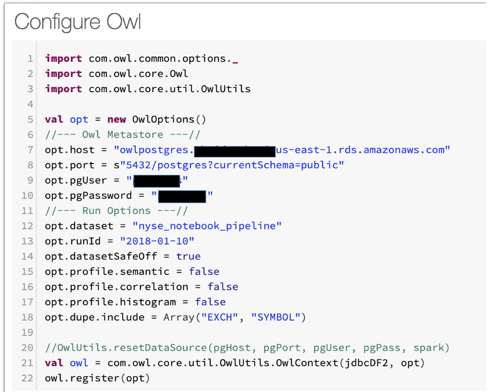
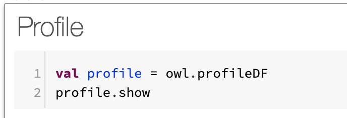
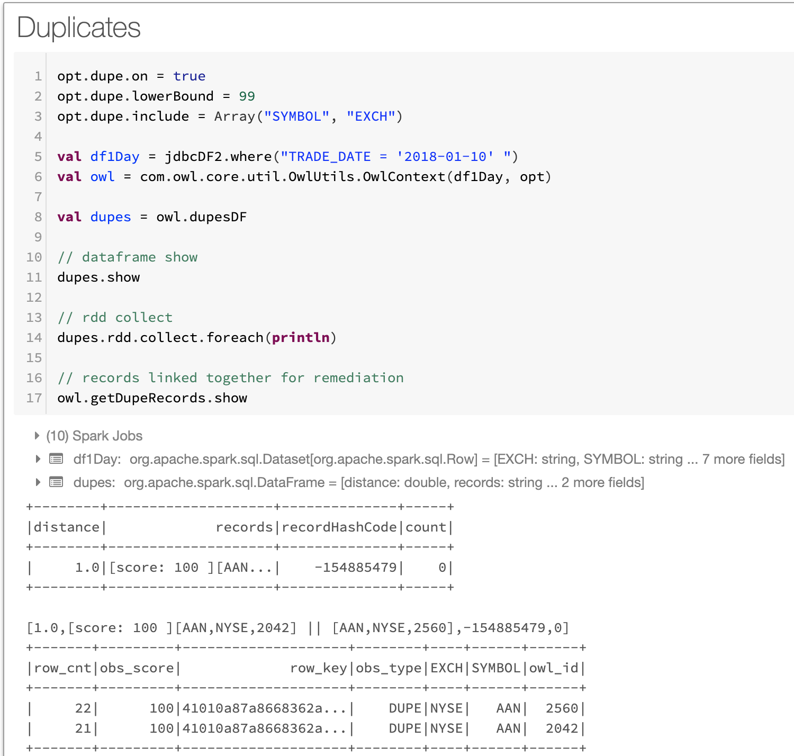
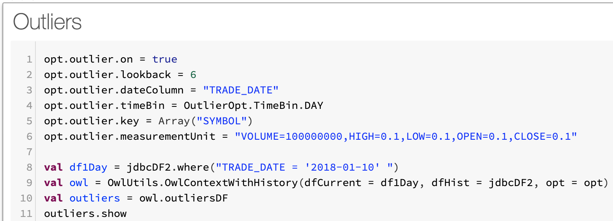

# AWS DataBricks - DQ Pipeline

## Getting started

First use vanilla spark to setup connection properties and access a database table via spark jdbc.



Code snippet and output below.

```scala
//--- GCP Postgres Connection ---// 
val url = "jdbc:postgresql://${host}?currentSchema=${schema}"
var connectionProps = new java.util.Properties()
connectionProps.setProperty("driver", "org.postgresql.Driver")
connectionProps.setProperty("user", "${user}")
connectionProps.setProperty("password", "${pass}")
connectionProps.setProperty("connectionUrl", url)

//--- Load DataFrame From GCP Postgres ---//
val jdbcDF2 = spark.read.jdbc(url, "owl_test.nyse", connectionProps)
jdbcDF2.printSchema
jdbcDF2.cache
val count = jdbcDF2.count
println(count)
```

```scala
root
 |-- EXCH: string (nullable = true)
 |-- SYMBOL: string (nullable = true)
 |-- TRADE_DATE: date (nullable = true)
 |-- OPEN: decimal(9,3) (nullable = true)
 |-- HIGH: decimal(9,3) (nullable = true)
 |-- LOW: decimal(9,3) (nullable = true)
 |-- CLOSE: decimal(9,3) (nullable = true)
 |-- VOLUME: integer (nullable = true)
 |-- PART_DATE_STR: date (nullable = true)

Row Count: 102,817
Runtime: 00:00:03 
```

## Next Configure Owl Options and Point to Owl Metastore

This requires that you have imported the Owl libraries into your notebook or databricks env.



## Next Run a Profile



```scala
+-------------+-----+-------+-----------+--------+-----------+------+----+------+-------+-------+------+------+---------+
|       column|nulls|empties|cardinality|is_mixed|mixed_ratio|   Int|Long|String|Decimal|Boolean|Double|  Date|Timestamp|
+-------------+-----+-------+-----------+--------+-----------+------+----+------+-------+-------+------+------+---------+
|         HIGH|    0|      0|      19159|   false|        0.0|     0|   0|     0| 102817|      0|     0|     0|        0|
|       SYMBOL|    0|      0|       3137|   false|        0.0|     0|   0|102817|      0|      0|     0|     0|        0|
|          LOW|    0|      0|      18845|   false|        0.0|     0|   0|     0| 102817|      0|     0|     0|        0|
|       VOLUME|    0|      0|      25856|   false|        0.0|102817|   0|     0|      0|      0|     0|     0|        0|
|   TRADE_DATE|    0|      0|         33|   false|        0.0|     0|   0|     0|      0|      0|     0|102817|        0|
|         EXCH|    0|      0|          2|   false|        0.0|     0|   0|102817|      0|      0|     0|     0|        0|
|        CLOSE|    0|      0|      15781|   false|        0.0|     0|   0|     0| 102817|      0|     0|     0|        0|
|PART_DATE_STR|    0|      0|         33|   false|        0.0|     0|   0|     0|      0|      0|     0|102817|        0|
|         OPEN|    0|      0|      16013|   false|        0.0|     0|   0|     0| 102817|      0|     0|     0|        0|
+-------------+-----+-------+-----------+--------+-----------+------+----+------+-------+-------+------+------+---------+
```

## Next Check for Duplicates



## Next Scan for Outliers



```scala
+-----+------+---------+----------+----------+
|  key|column|    value|prediction|confidence|
+-----+------+---------+----------+----------+
|TPG.E|VOLUME|  23400.0|       0.0|         0|
|MTB-C|VOLUME|      0.0|     100.0|         0|
|KOD.W|  OPEN|     2.35|     0.015|         1|
```

## Entire Code Snippet

```scala
//--- GCP Postgres Connection ---// 
val url = "jdbc:postgresql://${host}:5432/postgres?currentSchema=owl_test"
var connectionProps = new java.util.Properties()
connectionProps.setProperty("driver", "org.postgresql.Driver")
connectionProps.setProperty("user", "${user}")
connectionProps.setProperty("password", "${pass}")
connectionProps.setProperty("connectionUrl", url)

//--- Load DataFrame From GCP Postgres ---//
val jdbcDF2 = spark.read.jdbc(url, "owl_test.nyse", connectionProps)
jdbcDF2.printSchema
jdbcDF2.cache
jdbcDF2.count

//--- Owl Library Imports ---//
import com.owl.common.options._
import com.owl.core.Owl
import com.owl.core.util.OwlUtils

val opt = new OwlOptions()
//--- Owl Metastore ---//
opt.host = s"${host}"
opt.port = s"5432/postgres?currentSchema=public"
opt.pgUser = s"$user"
opt.pgPassword = s"$pass"

//--- Run Options ---//
opt.dataset = "nyse_notebook_pipeline"
opt.runId = "2018-01-10"
opt.datasetSafeOff = true

opt.dupe.on = true
opt.dupe.lowerBound = 99
opt.dupe.include = Array("SYMBOL", "EXCH")

opt.outlier.on = true
opt.outlier.lookback = 6
opt.outlier.dateColumn = "TRADE_DATE"
opt.outlier.timeBin = OutlierOpt.TimeBin.DAY
opt.outlier.key = Array("SYMBOL")
opt.outlier.measurementUnit = "VOLUME=100000000,HIGH=0.1,LOW=0.1,OPEN=0.1,CLOSE=0.1"

//--- Initialize Owl ---//
val currentDay = jdbcDF2.where(s"TRADE_DATE = '${opt.runId}' ")
val owl = OwlUtils.OwlContextWithHistory(dfCurrent = currentDay, 
                                dfHist = jdbcDF2, opt = opt)

//--- Pipeline Cmds ---//
owl.register(opt)
val profile = owl.profileDF
val outliers = owl.outliersDF
val dupes = owl.dupesDF
```

### Required configuration

* **DataBricks Runtime**: 5.4 \(includes Apache Spark 2.4.3, Scala 2.11\)
* **Python Version**: 3

### Required libraries

* **OWL jar file** _Example: owl\_core\_trunk\_jar\_with\_dependencies.jar_ 
* **JDBC driver:** org.springframework:spring-jdbc:4.3.16.RELEASE 
* **Database specific JDBC connector drivers** _Example\#1: mysql:mysql-connector-java:8.0.17 Example\#2: org.postgresql:postgresql:jar:42.2.8_


