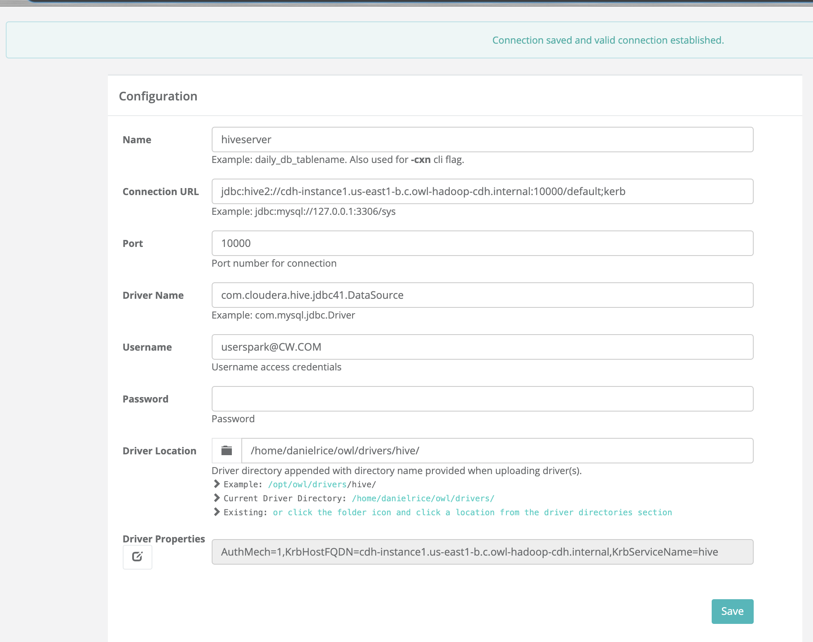
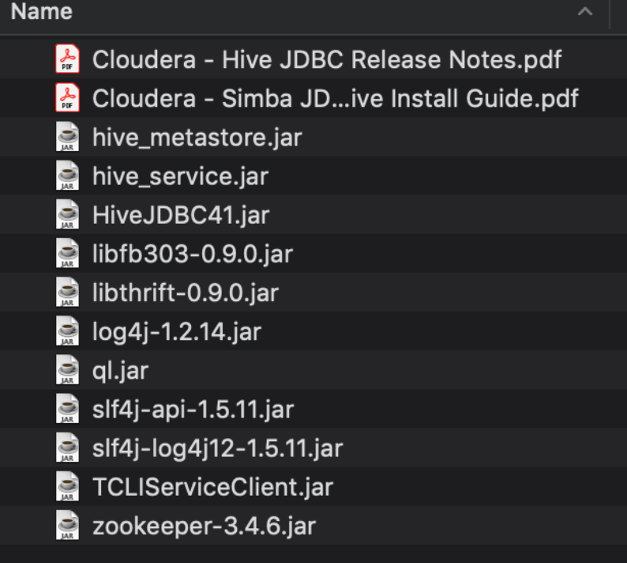

# OwlCheck Hive


Run a Data Quality check on a Hive table.  Use the -hive flag for a native connection via the HCat, this does not require a JDBC connection and is optimized for distributed speed and scale. 

### Hive Native, no JDBC Connection

Open source platforms like HDP, EMR and CDH use well known standards and because of this Owl can take advantage of things like HCat and it removes the need for JDBC connection details as well as offers optimum data read speeds.  Owl recommends and supports this with the -hive flag.

```bash
./owlcheck -ds hive_table -rd 2019-03-13 \
-q "select * from hive_table" -hive
```

Example output.  A hoot is a valid JSON response

```bash
{
  "dataset": "hive_table",
  "runId": "2019-02-03",
  "score": 100,
  "behaviorScore": 0,
  "rows": 477261,
  "prettyPrint": true
}
```

### Hive JDBC

1. You need to use the hive JDBC driver, commonly org.apache.hive.HiveDriver
2. You need to locate your driver JDBC Jar with the version that came with your EMR, HDP or CDH
   1. This jar is commonly found on an edge node under /opt/hdp/libs/hive/hive-jdbc.jar etc...

```bash
./owlcheck -rd 2019-06-07 -ds hive_table \
-u user -p pass -q "select * from table" \
-c "jdbc:hive2://10.142.1.3:10000/default" \
-driver org.apache.hive.HiveDriver \
-lib /opt/owl/drivers/hive/ \
-master yarn -deploymode client
```

#### HDP Driver - org.apache.hive.HiveDriver

#### CDH Driver - com.cloudera.hive.jdbc41.Datasource

For CDH all the drivers are packaged under, HiveJDBC41\_cdhversion.zip

### Troubleshooting

Test your hive connection via beeline to make sure it is correct before going further. 

```bash
beeline -u 'jdbc:hive2://10.142.1.3:10000/default;principal=hive/cdh-instance1.us-east1-b.c.company-hadoop-cdh.internal@CW.COM;useSSL=true' -d org.apache.hive.jdbc.HiveDriver
```

#### Kerberos Example

```bash
jdbc:hive2://10.142.1.3:10000/default;principal=hive/cdh-instance1.us-east1-b.c.company-hadoop-cdh.internal@CW.COM;useSSL=true
```

### Connecting Owl WebApp to Hive JDBC

Notice the driver properties for kerberos and principals.



In very rare cases where you can't get the jar files to connect properly one workaround is to add this to the owl-web startup script

```text
$JAVA_HOME/bin/java -Dloader.path=lib,/home/danielrice/owl/drivers/hive/ \
-DowlAppender=owlRollingFile \
-DowlLogFile=owl-web -Dlog4j.configurationFile=file://$INSTALL_PATH/config/log4j2.xml \
$HBASE_KERBEROS -jar $owlweb $ZKHOST_KER \
--logging.level.org.springframework=INFO $TIMEOUT \
--server.session.timeout=$TIMEOUT \
--server.port=9001 > $LOG_PATH/owl-web-app.out 2>&1 & echo $! >$INSTALL_PATH/pids/owl-web.pid
```

### Class Not Found apache or client or log4j etc...

Any class not found error means that you do not have the "standalone-jar" or you do not have all the jars needed for the driver.

#### Hive JDBC Jars

It is common for Hive to need a lot of .jar files to complete the driver setup.



### Java jar cmds

Sometimes it is helpful to look inside the jar and make sure it has all the needed files.

```text
jar -tvf hive-jdbc.jar
```

