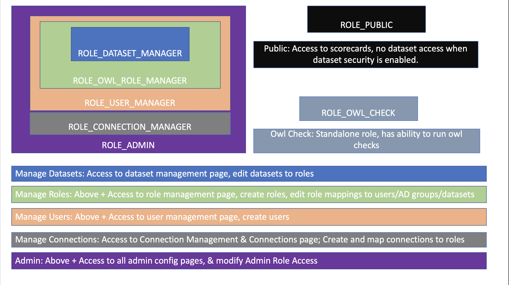

# Role Based Access Control \(RBAC\)

### RBAC Usages 

Owl supports RBAC configuration with both core roles and custom roles. Core roles include the following:

ROLE\_PUBLIC: Access to see dataset scores but no dataset interaction when dataset security is enabled.

ROLE\_OWL\_CHECK: Users or AD Groups mapped to this role will have the ability to run an owl check when Owl Check Security is enabled.

ROLE\_DATASET\_MANAGER: Manage Dataset to Role Mappings

ROLE\_OWL\_ROLE\_MANAGER: Manage Roles and User Mappings to Roles & Datasets

ROLE\_USER\_MANAGER: Manage Users and User Mappings to Roles & Datasets

ROLE\_CONNECTION\_MANAGER: Manage Connection to Role Mappings

ROLE\_ADMIN: Access to the administration pages \(Create connections, roles, users, AD, etc.\)

Custom roles can be added via the Role Management page by navigating to the Admin Console and clicking on the Roles Icon. Custom roles can also be added 'on the fly' during the Active Directory Role Mapping step.

It is these custom roles that will determine the users that have access to datasets \(including profile/rules/data preview/scoring\), and database connections

Additional information regarding setting up Dataset and Connection security can be found in those documents respectively.

