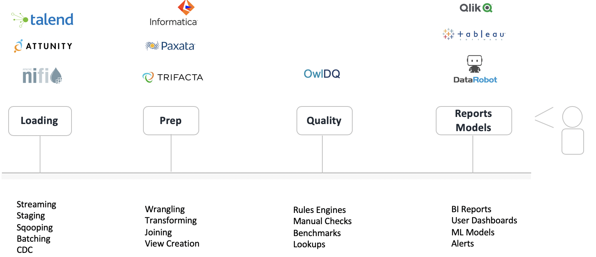
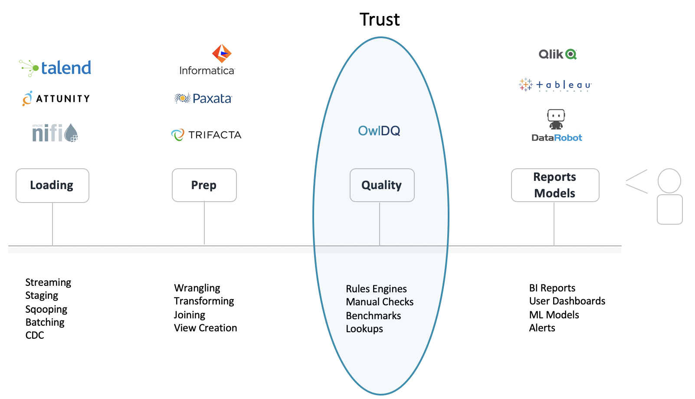

# Why Owl?

### Because: using raw data to drive key decisions, leads to incorrect answers and end user distrust.

Whether you use a BI tool to visualize data or you are responsible for serving data to downstream subscribes you always want to trust that your data is accurate. Showing data in a bar chart or PDF report that is inaccurate leads to a lack of confidence in the upstream group or data provider. Let’s start with a simple data pipeline, one that is generic enough that while it might not fit all data flow scenarios it is one we can largely agree on. Below you will see 4 main stages: Data Loading, Data Preparation, Data Verification \(DQ\), Data Reporting \(covers a broad category of all ways to see and deliver data\).

A description of the type of activities is provided under each of the 4 stages in the data pipeline. This will help us not get lost in the latest marketing jargon and stay focused on the fundamentals. There are many ways to ingest and transform data, the descriptions are not meant to be exhaustive. Imagine a scenario where data is loaded in either a batch or stream then joined to another dataset with some column transformations and finally made viewable in a BI tool for consumption. But what about quality? What are the checks and verifications that are put in place to guarantee the accuracy and correctness of the data? After all showing someone a housing report with incorrect estimated housing values or a stock report with the wrong stock prices won’t go over well. Figure 2 below has popular company logos overlaid in each stage to bring more context to the discussion. There are easily 30+ software companies in each of the 4 stages, Owl chose 3 popular companies in each sector at random. Owl is not ranking companies. Gartner is of course an obvious choice if you are looking for companies rankings per sector.

## So What’s the Problem?

The problem is detecting data issues is nuanced, manual and time consuming. The traditional approach to this problem to write bespoke code or use a rules engine to check on specific columns in a dataset. An example of a common rule is a _nullcheck_. If there was a concern that a column has missing data one way to  handle the situation is to write a condition to check for the null or missing data. Another common example is a _row count check_. A rule or piece of logic that checks if the number of rows in a dataset is greater than some amount. Of course DQ rules and business rules can get much more complicated than these two examples. Scale becomes a huge issue because it is nearly impossible to write all the rules that a business truly needs to be confident in their data. Often times the math is cols \* dbTables. 100 cols on average and 500 tables in a single warehouse is 50,000 rules if you only wrote 1 rule per column. The reality is you need many rules per column and your business has more that 500 tables and files. But there are even bigger problems with this strategy, rules are a reactive approach to solving the problem, they are manually written and they don’t adapt \(they are static\).  With a rules only approach you can measure your franchise risk by the number of rules you can write.  This requires coders, domain experts and a tool to write and then manage the rules.

### How Can Predictive DQ Help?

Owl intentionally solves the problem using a machine learning first, rules second based approach.  Owl automatically puts all columns under quality control.  This includes _nullchecks, emptychecks, statiscal profiles, sketches._  Owl creates snapshots and baselines in order to benchmark and discover for drift.  Owl automatically creates a ML labeling system for users to collaborate and down-train items with a click of a button.  The reason for this approach is obviously to gain more coverage reduce the dependency of manual rule building.  The greater technical benefit is that all of Owl's generated checks and rules are adaptive.  Owl is constantly learning from new data and will make predictions in many cases for typos, formatting issues, outliers and relationships.  This is a paradigm shift from risk being a measure of how many rules one can dream up and write, to simply click the Owl \[RUN\] button.                __ 

## Why a Pluggable DQ Solution?

Aren't their other DQ companies and solutions on the market?  Yes, absolutely.  The challenge is the vast ways IT groups consume and process data.  You need to find a product that can plug into Files the same way it can plug into DB Tables and Kafka Topics etc...  You need to find a product that offers a consistent feature set and covers all 9 dimensions of DQ.  There are many products that do 1 dimension of DQ such as just _rules_ or just _data drift.  Commonly,_ you will find that each dataset has unique challenges and requires a full DQ suite.  It is full coverage and consistency that drives trust.  There are also companies that cover more than one of the 4 stages above but most importantly you need a solution that can score and report on DQ across all databases, file systems and topics in the same way.  Owl is lightweight and can scan data no matter where it lives.  DQ needs to be abstracted from the ingestion tool to have a single view enterprise DQ strategy.  

## Do One Thing Extremely Well

Owl believes that data quality is such an important part of the data lifecycle that it requires a company which is solely committed to revolutionizing the way enterprises manage DQ.  This is why Owl has a prescriptive approach to DQ \(ML first, Rules second\).  The Owl software is purpose built for predicting and detecting DQ issues.  Much like how Jira is used as the standard for software project management even though it is absolutely possible to manage project line items in an excel sheet.  Businesses that really manage a lot of data you need Score Cards, Alerts, Reports, List Views, Collaboration, Down Training, Cataloging, Scheduling and much more.  

## Get Started

Give us a ring:  800-240-9554

Email us:  info@owl-analytics.com

##    

