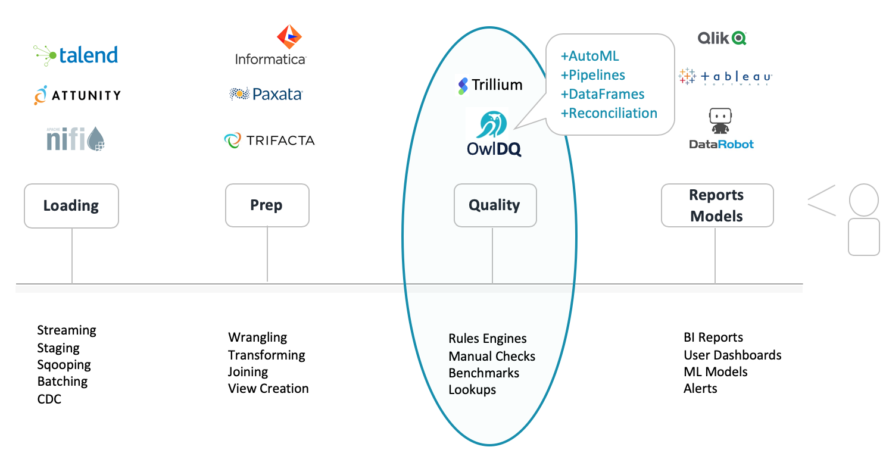
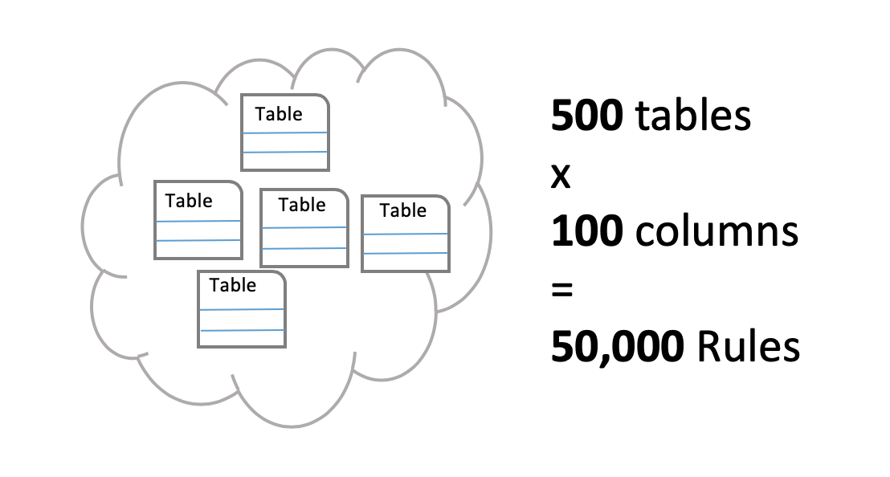
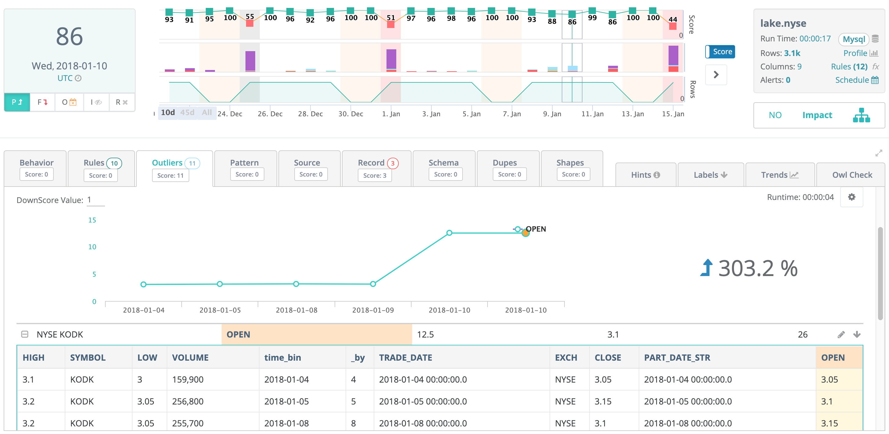
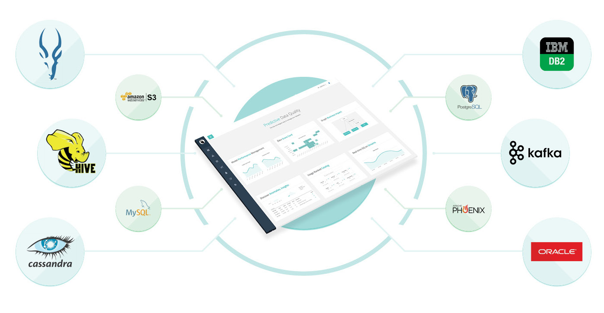

# Why Owl?

### Because: using raw data to drive key decisions, leads to incorrect answers and end-user distrust.

_OwlDQ is singularly focused on providing your end-users with the highest standards of data quality. We are purpose-built to solve the problem of data quality and to ensure end-user trust._

Whether you use a BI tool to visualize data or you are responsible for serving data to downstream subscribers, you always want to trust that your data is accurate. Showing inaccurate data in a bar chart or PDF report leads to a lack of confidence in the data provider.  Take, for example, the data pipeline below.  There are 4 main stages: Data Loading, Data Preparation, Data Verification \(DQ\), and Data Reporting which covers a broad category of all ways to see and deliver data.

In order to avoid getting lost in the latest marketing jargon, a fundamental description is provided under each of the 4 stages.  There are many ways to ingest and transform data; the descriptions are not meant to be exhaustive.  Imagine a scenario where data is loaded in either a batch or stream, then joined to another dataset with some column transformations, and finally made viewable in a BI tool for consumption.  But what about quality? What checks and verifications are in place to guarantee data accuracy and completeness?  After all, showing someone a housing report with incorrect estimated housing values or a stock report with the wrong stock prices won’t go over well. Figure 2 below has popular company logos overlaid in each stage to bring more context to the discussion. There are easily 30+ software companies in each of the 4 stages, Owl chose 3 popular companies in each sector at random. Owl is not ranking companies. Gartner is of course an obvious choice if you are looking for companies rankings per sector.

## So, What’s the Problem?

Detecting data issues is nuanced, manual and time consuming. The traditional solution is to write bespoke code or use a rules engine to validate specific columns in a dataset. If missing data is a concern a common remedy is to write a _nullcheck_. Another common example is a _row count check;_ a piece of logic that checks if the number of rows in a dataset is greater than a specified number. Of course, DQ and business rules can get much more complicated. Scale becomes a huge issue, because it is nearly impossible to write all the rules that a business truly needs to be confident in their data. Often times, the math is _f\(x\)  = columns \* dbTables_. 100 columns on average and 500 tables in a single warehouse equals 50,000 rules if you only wrote 1 rule per column. The reality is you need many rules per column, and your business has more than 500 tables and files. But there are even bigger problems with this strategy.  Rules are a reactive approach to solving the problem; they are manually written and they don’t adapt \(they are static\).  With a rules only approach you can measure your franchise risk by the number of rules you can write.  This requires coders, domain experts and a tool to write and then manage the rules.

### How Can Predictive DQ Help?

Owl intentionally solves the problem using a machine learning first, rules second based approach.  Owl automatically puts all columns under quality control.  This includes _nullchecks, emptychecks, statistical profiles, sketches._  Owl creates snapshots and baselines in order to benchmark past data and discover _drift_.  Owl automatically creates a ML labeling system for users to collaborate and down-train items with a click of a button.  The reason for this approach is obviously to maximize coverage while reducing the dependency of manual rule building.  The greater technical benefit is that all of Owl's generated checks and rules are adaptive.  Owl is constantly learning from new data and will make predictions in many cases for: typos, formatting issues, outliers and relationships.  This is a paradigm shift **from**, _risk being a measure of how many rules one can dream up and write_, **to** _simply click the Owl \[RUN\] button_.                __ 

## Why a Unified DQ Solution?

Aren't their other DQ companies and solutions on the market?  Yes, absolutely.  The challenge is the vast ways IT groups consume and process data.  You need to find a product that can plug into Files the same way it can plug into DB Tables, Data Frames and Kafka Topics etc...  You need to find a product that offers a consistent feature set and covers all 9 dimensions of DQ.  There are many products that do 1 dimension of DQ such as just _rules_ or just _data drift._  Commonly_,_ you will find that each dataset has unique challenges and requires a full DQ suite.  Complete coverage and consistency drive trust.  A single scoring and reporting framework that is flexible to meet each business group's needs.  Owl is horizontally scaleable, it can scan data from any location with infinity scale.  DQ needs to be abstracted from the ingestion tool to have a single view enterprise DQ strategy.  

## Do One Thing Extremely Well

Owl believes that data quality is such an important part of the data lifecycle that it requires a company which is solely committed to revolutionizing the way enterprises manage DQ.  This is why Owl has a prescriptive approach to DQ \(ML first, Rules second\).  The Owl software is purpose built for predicting and detecting DQ issues.  Much like how Jira is used as the standard for software project management even though it is absolutely possible to manage project line items in an excel sheet.  Businesses that manage a lot of data require Score Cards, Alerts, Reports, List Views, Collaboration, Down Training, Cataloging, Scheduling and much more.  

## Get Started

Give us a ring:  800-240-9554

Email us:  info@owl-analytics.com

### Does your DQ Solution Have?

|  |  |
| :--- | :--- |
| **Unified DQ** | The ability to score and manage and report on all datasets \(files, tables, topics\) agnostically.  Providing a single pain of glass for DQ across all data sources. |
| **Collaboration** | The ability for end-users to down-train, annotate and audit each DQ item |
| **Auto Discovery** | The ability to figure out issues in your data without requiring domain experts and rule writers |
| **Anomaly Detection** | The ability to detect numeric and categorical outliers in a dataset |
| **Correlation Analysis** | The ability to measure the lift or relationship between numeric columns |
| **Relationship Analysis** | The ability to discover and make predictions on hidden relationships in your data |
| **Alerting** | The ability to send out alerts when DQ scores drop |
| **Scheduling** | The ability to schedule DQ jobs with a click of a button in the UI |
| **Profiling** | The ability to provide descriptive statistics about the current run overlaid with the past runs for trend analysis |
| **Reconciliation** | The ability to validate the source and target dataset in timeline snapshots |
| **Duplicate Detection** | The ability to find exact and similar matches in data records |
| **Lineage Graphs** | The ability to asses business impact via a business impact score by understanding how connected each dataset is |
| **Schema Evolution** | The ability to detect changes in data types, additions and removals |
| **Rules** | The ability to write custom rules for simple and complex scenarios |

##    

